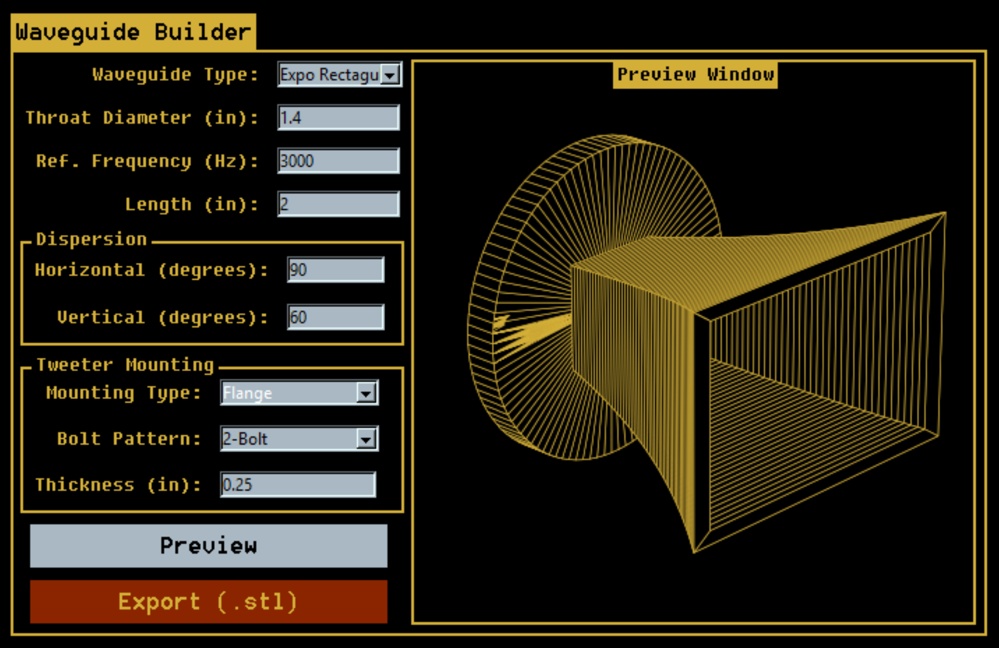

# Waveguide Builder

  
*A visual tool for designing 3D waveguides with STL export support.*

## Overview

Waveguide Builder is a Python-based GUI application for generating 3D visualizations of conical and exponential acoustic horns. It allows users to quickly enter physical parameters and visualize the result in 3D, with options to export the final model as an STL file for prototyping or simulation.

> Note: This tool is intended for visualization and basic estimation only — physical results may vary in real-world speaker applications.

## Features

- Select waveguide type: Conical, Exponential (Rectangular or Conical)
- Adjustable throat diameter, frequency, length, and dispersion angles
- Custom flange and bolt pattern configurations
- 3D visualization with matplotlib
- STL export with automatic mesh generation
- First-use spin animation and visual preview window

## Getting Started

1. Run the Python script:  
   ```bash
   python waveguide_builder.py
